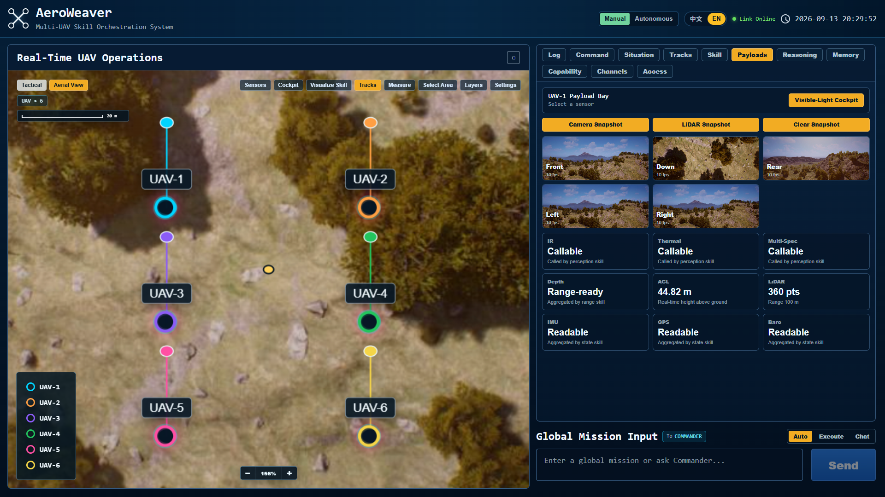

# AeroWeaver

**An embodied-agent harness for distributed, adaptive UAV swarms.**

[](https://arxiv.org/abs/2609.18520)

[中文](docs/README_CN.md) · [Paper](https://arxiv.org/abs/2609.18520) · [Paper appendix](docs/PAPER_APPENDIX.md) · [User guide](docs/USAGE.md)

AeroWeaver turns natural-language missions into coordinated multi-UAV execution.
It connects LLM agents to registered skills, gives each UAV its own decision
context and execution channel, and reuses role-specific experience to adapt skill
selection without retraining the model.



## Core Capabilities

- **Skill grounding** — Registered skills connect model decisions to executable actions, with parameter validation and runtime guards.
- **Distributed execution** — Commander assigns roles and local goals; each UAV agent observes, communicates, and controls its own vehicle.
- **Experience reuse** — Observed rewards from matching tasks and roles refine future skill selection without updating model weights.
- **Operator console** — A bilingual Web interface for manual control, autonomous missions, live telemetry, sensor views, and trajectory inspection.

Supports **Mock**, **AirSim**, and **PX4/Gazebo** adapters. Start with Mock to explore the console without an external simulator or API key.

## Quick Start

Requires **Python 3.10+**, **Node.js 22.12+** (or 20.19+), and **npm 10+**.

```bash
git clone https://github.com/Admire-ljb/AeroWeaver.git
cd AeroWeaver
python -m venv .venv
```

Activate the environment: `source .venv/bin/activate` on Linux/macOS, or `.\.venv\Scripts\Activate.ps1` in Windows PowerShell. Then run:

```bash
pip install -r requirements/mock.txt
npm --prefix frontend ci
npm --prefix frontend run build
python backend/server.py
```

Open **[http://127.0.0.1:5001](http://127.0.0.1:5001)**. A fresh checkout starts in Mock and Manual mode. Select a UAV and try a skill from the console.

For language-driven missions, [configure a model](docs/USAGE.md#enabling-llm-mode), switch to **Autonomous**, and enter a task such as:

> Have UAV-1, UAV-2, and UAV-3 form a triangle with 8-meter spacing, then orbit for 20 seconds.

## Documentation

| Need | Read |
| --- | --- |
| Setup, operating modes, AirSim, LLMs, and skill examples | [User guide](docs/USAGE.md) |
| Task definitions, rewards, runtime evidence, and evaluation | [Paper appendix](docs/PAPER_APPENDIX.md) |
| Tests and repository structure | [Development guide](docs/USAGE.md#development) |
| PX4/Gazebo and container deployment | [Deployment options](docs/USAGE.md#px4gazebo-and-docker) |

## Citation

If you use AeroWeaver in your research, please cite [our paper](https://arxiv.org/abs/2609.18520).

```bibtex
@misc{lou2026aeroweaver,
  title         = {{AeroWeaver}: An Embodied-Agent Harness for Weaving Aerial Skills into Distributed, Adaptive Swarm Execution},
  author        = {Jiabin Lou and Yirong Yang and Haopeng Wang and Xuxin Lv and Xinyu Liu and Diyuan Hou and Xuehong Liu and Rongye Shi and Wenjun Wu},
  year          = {2026},
  eprint        = {2609.18520},
  archivePrefix = {arXiv},
  primaryClass  = {cs.AI},
  url           = {https://arxiv.org/abs/2609.18520}
}
```

## Safety & License

Research software: validate in simulation before physical flight, with independent geofencing, emergency stop, and operator supervision. [MIT License](LICENSE).
