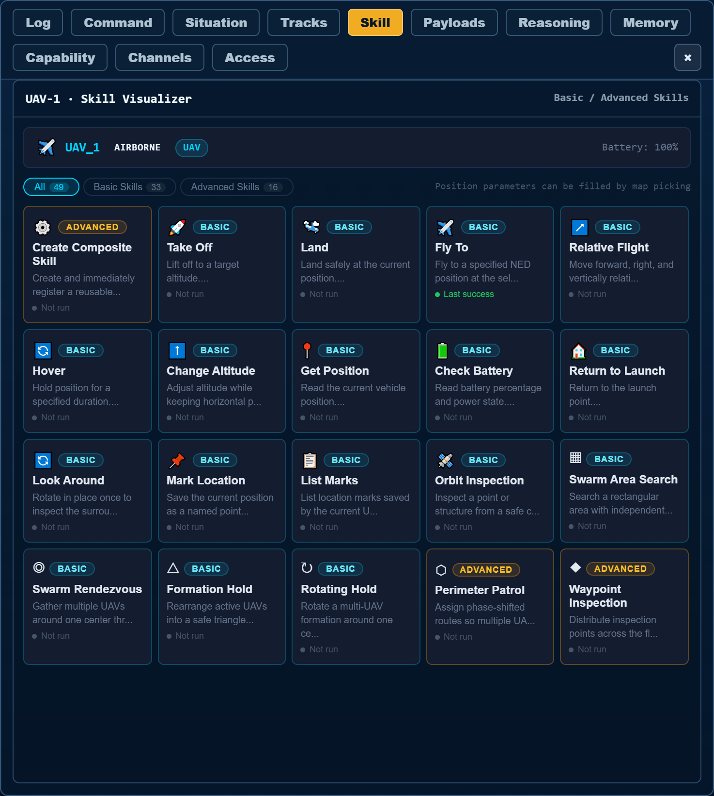
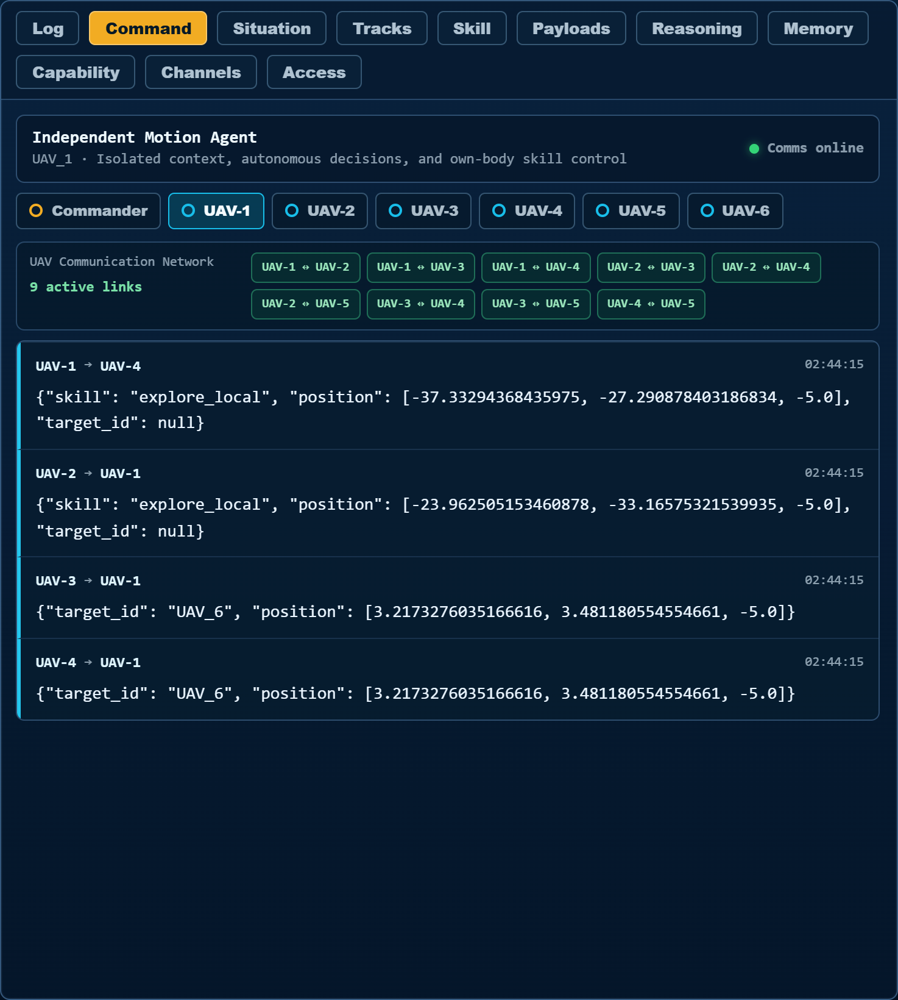
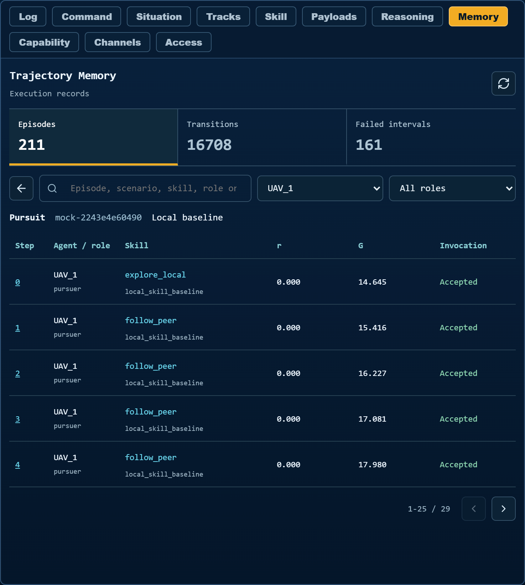

# AeroWeaver: Supplementary Details

[← Repository README](../README.md)

This repository appendix accompanies **AeroWeaver: An Embodied-Agent Harness for Weaving Aerial Skills into Distributed, Adaptive Swarm Execution**. It collects implementation details, task definitions, reward functions, runtime examples, and complementary evaluation material. The conference manuscript is maintained as a self-contained eight-page paper; this document provides additional repository documentation.

## Contents

- [Implementation details](#implementation-details)
- [Task specifications](#task-specifications)
- [Evaluation details](#evaluation-details)
- [Prompt variants](#prompt-variants)
- [Example data and provenance](#example-data-and-provenance)

## Implementation Details

The shared catalog contains 22 task skills with typed inputs and role-dependent preconditions. Mission-level activation selects a candidate subset; each agent's role, observations, and task state determine its callable skill–parameter pairs. Invocations act only through the executor bound to the requesting UAV. Commander assigns roles and local goals without issuing flight actions for local agents.

The evaluation runner freezes the shared world while the agents select actions from the same round's observations. After their selections are collected, the executors apply body-local commands and the simulator advances by 0.5 s before recording rewards and the next observations. Messages generated in a round enter the next decision context. Motion commands persist between decisions through the common local tracker; an invalid decision or invocation is recorded and replaced by an own-body hold. Opponent policies and the motion executors are shared across compared methods.

**Selector scores and experience retrieval.**
Callable skill–parameter pairs are assigned distinct single-letter labels. The base score is the provider-reported log probability of the label at the first output token, with up to 20 alternatives returned. Parameterizations of the same skill have separate base scores and share its advantage. For omitted candidates, a full list of 20 alternatives supplies an upper probability bound. The corrected winner is accepted only if omitted candidates cannot exceed it; otherwise, the selector retains the highest observed base score. Missing scores are not fabricated.

Retrieval filters records by exact task and semantic role, observed return, and reuse eligibility. State descriptions are serialized with sorted keys, lowercased, and tokenized into alphanumeric/underscore sequences and individual Chinese characters. Records are ranked by Jaccard token-set overlap, with recency breaking ties; up to 32 are retained. The baseline and per-skill returns are unweighted means. Records from different bodies may contribute when task and role match; an unobserved skill receives zero correction.

The update uses $\gamma=0.95$ and $\beta=0.8$, without standardizing, clipping, or rescaling returns or advantages. The common coefficient therefore has a task-dependent numerical influence. Ablation normalization is used only for reporting. Newly observed rewards extend earlier returns within the same participant's trajectory, and only values available before the decision are retrieved. Termination finalizes these records; model weights and executors remain fixed.

The [operator console screenshot](#operator-console) shows the deployment interface. Mission Input accepts language instructions; the remaining workspaces expose skill state, reasoning, memory, per-UAV capabilities, payloads, and trajectories while preserving body-scoped dispatch.

**Operator console.** AeroWeaver connected to AirSim with six active UAVs. The left workspace displays UAV identities and recorded trajectories over the aerial scene; the right workspace shows the selected UAV's five onboard camera views and live sensor status above the global mission input.

**Protocol tests.**

The [protocol test table](#protocol-tests) summarizes application-level tests of mission progress, dissent-aware closure, timeout and cancellation, per-UAV evidence propagation, and body-scoped dispatch, independently of simulator performance metrics.

| Protocol surface | Tests | Pass rate |
| --- | --- | --- |
| Mission progress, dissent, closure, timeout | 8 | 1.000 |
| Per-UAV context, evidence, and links | 7 | 1.000 |
| Body-bound runtime authority | 3 | 1.000 |
| **Total** | **18** | **1.000** |

Application-level protocol tests for distributed closure and embodied authority, executed with the repository test suite.

The [workspace screenshots](#operator-workspaces) show the Skill library, live multi-agent communication, and Memory workspaces.

| (A) Skill library | (B) Communication | (C) Memory |
| --- | --- | --- |
|  |  |  |

**Operator workspaces.** (A) Registered basic and advanced skills for UAV-1; this deployment library is broader than the 22 evaluation task skills. (B) Live Mock pursuit with five pursuers and one evader, showing nine active UAV links and exchanged intent and target-position messages. (C) Stored skill trajectories, immediate rewards ($r$), and discounted returns ($G$) from an earlier pursuit episode. Both pursuit runs use the local skill baseline. Click an image to open its complete view.

**Skill activation and invocation example.**
In an archived Mock collection episode, mission activation reduces the 22-skill catalog to eight skills: `collect_treasure`, `deliver_treasure`, `explore_local`, `follow_peer`, `hold_position`, `meet_collector`, `return_in_bounds`, and `signal_target`.
At logged step 11, UAV-4, assigned the blue-deposit role, has the three callable candidates listed in [Experience correction table](#experience-correction-table).
In the same round, collector UAV-2 invokes `deliver_treasure` with `target_id=UAV_3`.
The interface accepts a target from the requesting agent's local task options and returns the actuated `robot_id` and command-persistence status. Here the returned body is UAV-2: UAV-3 is the delivery destination, while the invocation controls UAV-2's motion.
This example links the task-level catalog to role- and state-dependent choices and a body-bound execution interface.

**Experience correction example.**
For the same UAV-4 decision, retrieval supplies 11 earlier records from the blue-deposit role: ten for `hold_position` and one for `return_in_bounds`. Their mean observed discounted return is 11.174; the respective skill means are 11.356 and 9.351. Subtracting the shared baseline gives the advantages in [Experience correction table](#experience-correction-table); `explore_local` has no retrieved record and receives zero correction. With $\beta=0.8$, the selected candidate changes from `return_in_bounds` to `hold_position`. The executor records zero velocity for UAV-4. All three base scores are available, and the update uses only returns observed before this decision. This trace illustrates the score-update mechanism within an episode.

| Candidate | Retrieved records | Base $z_i$ | Advantage $\widehat A_i$ | Corrected $z_i+0.8\widehat A_i$ |
| --- | --- | --- | --- | --- |
| `return_in_bounds` | 1 | **-0.724** | -1.823 | -2.182 |
| `explore_local` | 0 | -1.683 | 0.000 | -1.683 |
| `hold_position` | 10 | -1.121 | 0.182 | **-0.975** |

Recorded scores for UAV-4 at logged step 11 of a Mock collection episode. Bold entries identify the highest base and corrected scores. All candidates use empty parameter dictionaries. [Full-precision scores](paper-appendix-data/experience_score_table.csv) · [11 retrieved records](paper-appendix-data/experience_retrieved_records.csv) · [Decision-time trace](paper-appendix-data/experience-decision.json).

## Task Specifications

The nine tasks use a planar point-mass runtime with a default $140\times140$ m arena and fixed altitude. Initial agent positions and task objects are perturbed using the episode seed. Each local observation contains the agent's position and velocity, visible neighbors and objects, received messages, and currently callable skill–parameter pairs. The default neighbor-sensing and communication ranges are 45 m and 55 m, respectively; the world-communication leader senses neighbors within 100 m. Public landmarks and formation geometry remain visible independently of neighbor range. Private goals, keys, and message symbols are exposed only to their designated roles.

Rewards are computed by the MPE2 1.1.0 scenario reward functions applied to the runtime state. Movement, task completion, and object transitions remain those of the point-mass runtime. Let $x_i$ denote an agent's arena-normalized position, $d_{ij}=\|x_i-x_j\|_2$, and $c_{ij}=\mathbf{1}[d_{ij}<s_i+s_j]$ the reward-level contact indicator for entity radii $s_i,s_j$. Except for formations, coordinates are divided by 70 m after centering. Coverage agents have radius 0.15; pursuers, leaders, adversarial roles, and collection deposits have radius 0.075; other agents have radius 0.05, except world-communication foragers (0.045). Food and treasure radii are 0.03 and 0.025. These reward contacts differ from the metric-distance completion conditions stated below.

The boundary penalty used in pursuit and world communication is

$$
b(z)=\begin{cases}
0,&z<0.9,\\
10(z-0.9),&0.9\leq z<1,\\
\min\{\exp(2z-2),10\},&z\geq1.
\end{cases}
$$

### Coverage

Three searchers coordinate to cover three public landmarks. Each searcher chooses a landmark through `cover_landmark`, while local observations and peer reports support distinct assignments. For landmark set $L$ and searcher set $S$, the reward of searcher $i$ is

$$
r_i=-\tfrac12\sum_{\ell\in L}\min_{j\in S}d_{j\ell}
    -\tfrac12\sum_{j\in S\setminus\{i\}}c_{ij}.
$$

This combines the shared landmark-distance reward and individual collision penalties with equal weights. Completion requires every landmark to have an agent within 3 m for three consecutive rounds.

### Pursuit-Evasion

Three pursuers coordinate against one faster evader. Pursuers select `pursue_target` or follow a received target report through `follow_peer`; the fixed evader policy uses local escape and boundary-return actions. Let $P$ and $E$ denote pursuers and evaders. The rewards are

$$
r_p=10\sum_{j\in P}\sum_{e\in E}c_{je},\qquad
r_e=-10\sum_{p\in P}c_{pe}-\sum_{k=1}^{2}b(|x_{e,k}|).
$$

Pursuer rewards share all team contacts. The runtime declares capture when at least two pursuers are within 6 m of each evader in the same round. A positive contact reward therefore does not by itself imply task completion. Reported team returns include pursuers only.

### Guided Navigation

A stationary speaker knows which of three landmarks is the goal; a mobile listener sees the public landmarks but receives no private goal identifier. The speaker invokes `signal_goal`, and a received goal message enables the listener's `follow_signal` action. Both roles receive the negative squared listener–goal distance,

$$
r_{\mathrm{speaker}}=r_{\mathrm{listener}}=-\|x_{\mathrm{listener}}-x_g\|_2^2.
$$

For an instance with multiple listeners, the speaker receives their mean reward and each listener retains its own distance reward. Completion requires all listeners to remain within 3 m of the goal for three consecutive rounds.

### Private Communication

A stationary sender and receiver share a private key, while a stationary eavesdropper observes ciphertext without the key or plaintext. Symbols lie in $\{0,1,2,3\}$ and the communication protocol uses two-bit XOR. The task interfaces are `encode_message`, `decode_message`, and `guess_message`. Let $y$ be the one-hot plaintext vector and $\hat y_R,\hat y_E$ the receiver and eavesdropper outputs. Writing $a_R,a_E$ for indicators that an output has been submitted, the rewards are

$$
r_S=r_R=a_E\|\hat y_E-y\|_2^2-a_R\|\hat y_R-y\|_2^2,
\qquad r_E=-a_E\|\hat y_E-y\|_2^2.
$$

Unsubmitted outputs contribute zero. The protocol terminates after three rounds, whereas task success additionally requires correct receiver reconstruction and an incorrect eavesdropper guess. The evaluated team consists of the sender and receiver; the eavesdropper follows the fixed opponent policy.

### Circular Formation

Five formation members move to distinct slots on a circle of radius 22 m using `take_formation_slot`. Reward coordinates are centered on the formation landmark and scaled so that this radius becomes 0.5. The reward builds five equally spaced ideal positions $q_j$, with orientation set by the smallest current agent angle, and finds the minimum-distance bipartite assignment $\pi^*$. Every member receives

$$
r_i=-\frac{1}{N}\sum_{j=1}^{N}
\min\{\|x_j-q_{\pi^*(j)}\|_2,2\},\quad
\pi^*\in\arg\min_{\pi}\sum_{j=1}^{N}\|x_j-q_{\pi(j)}\|_2.
$$

The reward evaluates formation geometry, while execution uses fixed owner-specific slots. Completion requires every member to remain within 3 m of its assigned slot for three consecutive rounds.

### Line Formation

Five formation members occupy evenly spaced slots along a line between two public endpoint landmarks. Each member invokes `take_formation_slot` for its own assigned slot. Reward coordinates are centered on the outermost slots and scaled so that their 56 m span becomes 1.25. The shared reward follows [Formation reward](#formation-reward), using the fixed line-slot positions as $q_j$. As in circular formation, reward matching is permutation-invariant, whereas completion checks each owner's assigned slot: all errors must remain below 3 m for three consecutive rounds.

### World Communication

A mobile leader and two pursuers coordinate against two foragers around two food sites and two forest regions. The leader can transmit target evidence through `signal_target` and also pursue targets. Foragers use `seek_food`, `seek_cover`, and `evade_peer`. Forest cover hides an occupant from an outside observer other than the leader. For pursuing team $P$ (including the leader), foragers $F$, and food sites $L_f$, rewards are

$$
\begin{aligned}
r_p&=5\sum_{j\in P}\sum_{f\in F}c_{jf}-0.1\min_{f\in F}d_{pf},\\
r_f&=-5\sum_{p\in P}c_{pf}-2\sum_{k=1}^{2}b(|x_{f,k}|)
       +2\sum_{\ell\in L_f}c_{f\ell}-0.05\min_{\ell\in L_f}d_{f\ell}.
\end{aligned}
$$

Foragers follow fixed policies and are excluded from the evaluated team return. Food visits, cover occupancy, and pursuit contacts are recorded as diagnostics. This task runs to the episode horizon and has no binary success definition.

### Collection-Delivery

Two collectors transport four treasures to two mobile deposit participants, one red and one blue. Each collector carries at most one treasure. Pickup and delivery require the corresponding skill invocation within 3 m; delivery also requires a matching deposit type. Deposits use `meet_collector` to approach compatible loaded collectors.

Let $C$ and $D$ be collector and deposit sets. Let $n_{\mathrm{pick}}$ count reward-level contacts between empty collectors and available treasures, and $n_{\mathrm{drop}}$ count contacts between loaded collectors and matching deposits. With $g=5(n_{\mathrm{pick}}+n_{\mathrm{drop}})$, rewards are

$$
r_c=g-5\sum_{j\in C\setminus\{c\}}c_{cj}-0.1\delta_c,
\qquad r_d=g-0.1\delta_d.
$$

For an empty collector, $\delta_c$ is the distance to the nearest available treasure; for a loaded collector, it is the distance to the nearest matching deposit. A missing eligible target contributes zero distance penalty. For a deposit, $\delta_d$ is the nearest compatible carrier distance, or the distance to the collectors' centroid when none carries the matching type. Reward contacts are evaluated from the current cargo and availability state after the runtime step; they are not an extra bonus for each recorded pickup or delivery event. No native treasure respawn is applied. All four participants contribute to the evaluated return, and completion requires delivery of all four treasures.

### Goal Concealment

Two informed agents know a private goal among three public landmarks, while an adversary infers the goal from its local observations. Informed agents may invoke `approach_goal` or `approach_decoy`; the adversary uses `infer_goal` without access to the private identifier. For informed set $I$, adversary set $A$, and true goal $g$, rewards are

$$
r_i=\sum_{a\in A}d_{ag}-\min_{j\in I}d_{jg},\qquad r_a=-d_{ag}.
$$

The informed team is rewarded for reaching the true goal while keeping the adversary away. The adversary follows a fixed policy and is excluded from the evaluated return. Goal distances are recorded throughout the episode; this task has no binary success definition and terminates at the horizon.

### Task skill interfaces

| Task | Role | Skill interfaces |
| --- | --- | --- |
| Coverage | Searcher | `cover_landmark` |
| Pursuit-evasion | Pursuer | `pursue_target`, `follow_peer` |
|  | Evader | `evade_peer`, `return_in_bounds` |
| Guided navigation | Speaker / listener | `signal_goal` / `follow_signal` |
| Private communication | Sender / receiver | `encode_message` / `decode_message` |
|  | Eavesdropper | `guess_message` |
| Circular formation | Formation member | `take_formation_slot` |
| Line formation | Formation member | `take_formation_slot` |
| World communication | Leader | `pursue_target`, `signal_target` |
|  | Pursuer | `pursue_target`, `follow_peer` |
|  | Forager | `seek_food`, `seek_cover`, `evade_peer` |
| Collection-delivery | Collector | `collect_treasure`, `deliver_treasure` |
|  | Red / blue deposit | `meet_collector` |
| Goal concealment | Informed agent | `approach_goal`, `approach_decoy` |
|  | Adversary | `infer_goal` |

These interfaces describe executable capabilities, not a fixed activation result for every episode. Opponent roles specify the environment. Targeted actions take a locally admissible `target_id`; symbolic actions use `symbol`. Common interfaces include `hold_position` and, for mobile roles, `explore_local`. The activated catalog, role preconditions, available messages, visibility, and cargo state determine callable options. Listing an interface does not grant control of another UAV.

## Evaluation Details

The main comparison evaluates the nine tasks with an episode horizon of 24 rounds and the task-specific early termination rules in [Task specifications](#task-specifications). Let $C$ be the set of controlled participants, excluding fixed opponents, and let $T$ be the number of executed rounds. The reported episode return averages undiscounted returns over these participants:

$$
R=\frac{1}{|C|}\sum_{i\in C}\sum_{t=1}^{T}r_{i,t}.
$$

The evader, eavesdropper, foragers, and concealment adversary are excluded from their respective task returns. The remaining tasks include all participants. Environment rewards are stored without alteration; the experience updater separately uses discounted returns $G_{i,t}=\sum_{u=t}^{T}\gamma^{u-t}r_{i,u}$. Discounting is not applied to $R$.

The six conditions share the same task interfaces, action constraints, and skill executors. The skill-activation ablation exposes the full catalog; the coordination-report ablation suppresses controlled-agent intent and target reports while retaining intrinsic goal and ciphertext channels; the reward-correction ablation sets its correction coefficient to zero. These controls retain the task reward definitions.

The main-results table reports raw episode returns for the complete method and the two baselines. [Ablation return table](#ablation-return-table) compares AeroWeaver with the three component ablations in return units, supplementing the relative means in the main-text ablation table. The full-method column repeats the same mean and SD to make the within-task comparisons self-contained.

The relative score is the ratio of a positive transformed score to the full-method score within the same task. For a task-wise affine transform $P_{t,m}=a_t\bar R_{t,m}+b_t$ with $a_t>0$, let $Q_{t,m}=P_{t,m}/P_{t,\mathrm{full}}$. Its inverse can be written as

$$
\bar R_{t,m}=\bar R_{t,\mathrm{full}}+K_t(Q_{t,m}-1),
\qquad s^R_{t,m}=K_t s^Q_{t,m},
\qquad K_t=\frac{P_{t,\mathrm{full}}}{a_t}>0.
$$

Here $s^R$ and $s^Q$ are SDs in return and relative-score units. The conversion factors in [Ablation return table](#ablation-return-table) retain the existing task-wise transform. Means follow the current main-text table, retaining original precision for unchanged entries and using three-decimal scores for revisions. Rounding uncertainty for revised means is at most $0.0005K_t$. SDs retain their supplied values. Directly multiplying a raw return by $Q$ would omit the affine offset and can reverse the ordering when returns are negative.

### Component ablation returns

| Task | $K_t$ | AeroWeaver | w/o skill activation | w/o coordination reports | w/o reward correction |
| --- | --- | --- | --- | --- | --- |
| Coverage | 17.077 | **−14.200 ± 0.950** | −20.182 ± 0.143 | −19.188 ± 0.254 | −18.239 ± 0.334 |
| Pursuit-evasion | 17.606 | **130.000 ± 4.800** | 124.184 ± 4.243 | 126.149 ± 4.278 | 126.884 ± 4.243 |
| Guided navigation | 15.029 | **−7.100 ± 0.320** | −11.100 ± 0.306 | −12.631 ± 0.265 | −10.073 ± 0.200 |
| Private communication | 15.969 | **−1.850 ± 0.090** | −4.850 ± 0.369 | −7.966 ± 0.360 | −3.855 ± 0.309 |
| Circular formation | 16.801 | **−8.200 ± 0.100** | −12.200 ± 0.430 | −12.190 ± 0.400 | −11.140 ± 0.352 |
| Line formation | 14.280 | **−7.300 ± 0.220** | −11.274 ± 0.344 | −9.856 ± 0.319 | −10.184 ± 0.273 |
| World communication | 35.217 | **135.000 ± 5.200** | 127.601 ± 4.126 | 122.075 ± 4.328 | 129.855 ± 4.499 |
| Collection-delivery | 10.881 | **49.500 ± 0.680** | 45.491 ± 0.105 | 45.452 ± 0.190 | 47.480 ± 0.245 |
| Goal concealment | 13.505 | **−0.250 ± 0.110** | −3.267 ± 0.376 | −5.584 ± 0.433 | −3.224 ± 0.376 |

Mean ± SD, $n=10$ per condition. Full-method values match the paper's main-results table. Ablation means follow its component-ablation table and fixed $K_t$ factors; unchanged entries retain source precision and revised entries use displayed scores. SDs retain supplied values. These conversions are not additional runs.

**Additional experiment settings.**
The three main-text panels cover nine tasks with separate normalization references. Adaptation spans episodes 1–50, with each trajectory divided by its final-episode AeroWeaver score; model weights and executors remain fixed. Backbone sensitivity compares DeepSeek-V4-Flash, GPT-5.6 Luna, GLM-5.3-Flash, and qwen3.8-flash through shared skill and execution interfaces, using DeepSeek-V4-Flash as the task-wise denominator. Prompt sensitivity compares Original, Paraphrased, Reordered, and Distractors relative to Original. These scores describe within-task changes, not percentages of raw reward.

The complementary prompt evaluation in [Prompt variants](#prompt-variants) covers world communication and collection-delivery: four descriptions and three paired environment seeds per task give 24 episodes, each starting with empty memory. Only mission descriptions vary; system instructions, observation schema, skill documentation, and activated catalog remain fixed. The appendix supplies all eight descriptions and perturbation definitions. This two-task protocol applies to the accompanying examples, separately from the nine-task comparison.

## Prompt Variants

The [prompt descriptions below](#complete-prompt-descriptions) list the complete mission descriptions used in the measured two-task prompt experiment.
Each variant replaced only the mission-description field during local action selection; system instructions, observations, skill documents, and the task-level activated skill subset were not perturbed.
Each task used one fixed text per condition, evaluated over three paired environment seeds with fresh memory for each episode (24 episodes in total).
Paraphrasing preserved the task objectives and constraints, reordering reversed the original sentence order, and distractors appended task-irrelevant metadata with an explicit non-task disclaimer.
These conditions did not test contradictory instructions or adversarial prompt injection.

### Complete prompt descriptions

#### World communication

##### Original

> **[S1]** One mobile leader and two pursuers coordinate against two foragers. **[S2]** The leader has a wider sensing range and can inform its teammates. **[S3]** Pursuers seek contact with foragers, while foragers seek food and use forest cover to escape. **[S4]** Messages are exchanged only with reachable teammates.

##### Paraphrased

> **A** mobile leader **works with** two pursuers against two foragers. **With its broader sensing range, the leader can share information with** its teammates. **The pursuers aim to contact the foragers. The foragers look for food and evade pursuit using forest cover. Communication is restricted to teammates that are reachable.**

##### Reordered

> **[S4]** Messages are exchanged only with reachable teammates. **[S3]** Pursuers seek contact with foragers, while foragers seek food and use forest cover to escape. **[S2]** The leader has a wider sensing range and can inform its teammates. **[S1]** One mobile leader and two pursuers coordinate against two foragers.

##### Distractors

> One mobile leader and two pursuers coordinate against two foragers. The leader has a wider sensing range and can inform its teammates. Pursuers seek contact with foragers, while foragers seek food and use forest cover to escape. Messages are exchanged only with reachable teammates. *Unrelated archive metadata: the report folder is named Cedar; the cover sheet uses a gray border; the archived document has three sections. These metadata do not describe the arena or change the task.*

#### Collection-delivery

##### Original

> **[S1]** Two mobile collectors pick up treasures and deliver them to matching-color mobile deposit participants, one red and one blue. **[S2]** Each collector carries at most one treasure. **[S3]** Deposits meet compatible loaded collectors using local observations and peer reports.

##### Paraphrased

> Two **moving** collectors **gather** treasures and **bring** them to **moving deposit participants of the corresponding color:** one red and one blue. **A** collector **may carry no more than** one treasure. **Using local observations and peer reports, deposits rendezvous with loaded collectors carrying a compatible treasure.**

##### Reordered

> **[S3]** Deposits meet compatible loaded collectors using local observations and peer reports. **[S2]** Each collector carries at most one treasure. **[S1]** Two mobile collectors pick up treasures and deliver them to matching-color mobile deposit participants, one red and one blue.

##### Distractors

> Two mobile collectors pick up treasures and deliver them to matching-color mobile deposit participants, one red and one blue. Each collector carries at most one treasure. Deposits meet compatible loaded collectors using local observations and peer reports. *Unrelated archive metadata: the report folder is named Cedar; the cover sheet uses a gray border; the archived document has three sections. These metadata do not describe the arena or change the task.*

**Bold spans** mark rewrites, *italic spans* mark appended text, and **[S1]–[S4]** identify original sentences. These display annotations were not included in the tested prompts.

## Example data and provenance

The collection example is extracted from the archived episode `collection-aeroweaver_pilot-single_episode-66001`, at logged step 11 for UAV-4 (`deposit_blue`). Advantages and corrected scores were recomputed from the 11 returns available **at decision time** and checked against the recorded ranking. A missing skill mean denotes no retrieved record; its advantage is zero.

| File | Contents |
| --- | --- |
| [experience_score_table.csv](paper-appendix-data/experience_score_table.csv) | Full-precision base scores, advantages, corrected scores, retrieval counts, and selection flags |
| [experience_retrieved_records.csv](paper-appendix-data/experience_retrieved_records.csv) | The 11 records used at that decision, including observed discounted returns |
| [experience-decision.json](paper-appendix-data/experience-decision.json) | Original decision, candidate map, retrieval evidence, and executor output |
| [collection-activation.json](paper-appendix-data/collection-activation.json) | The eight activated task skills for the example episode |

The UI screenshots document separate runtime sessions. The Mock pursuit workspaces use the local skill baseline; the collection score table documents provider-score correction with retrieved experience. These examples illustrate implementation behavior and do not replace the paper's aggregate results.
