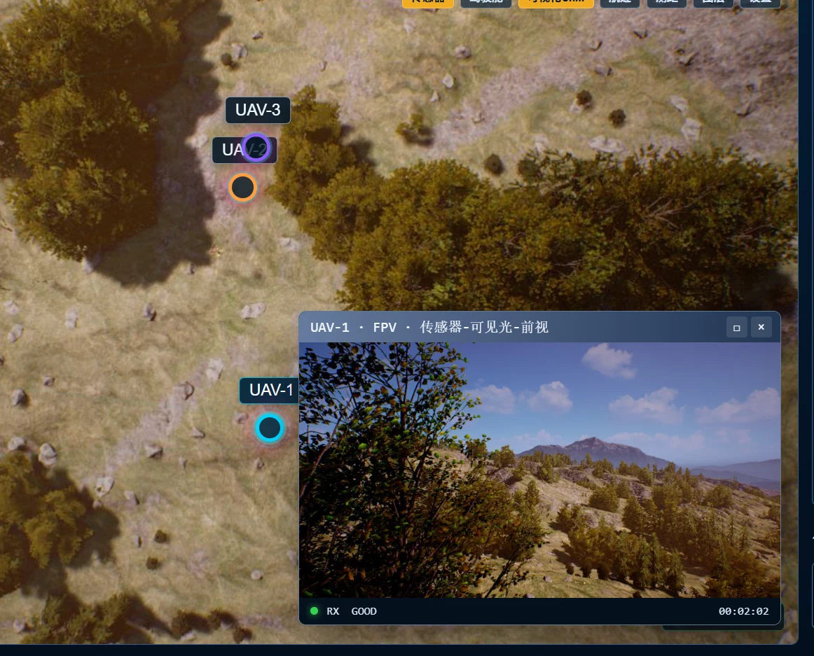

# AeroWeaver 使用指南

[← 项目概览](README_CN.md) · [English guide](USAGE.md)

本文保留运行模式、仿真器与模型配置、技能参数示例及开发说明。
任务定义、奖励函数和实验细节见[论文附录](PAPER_APPENDIX.md)。除步骤中明确切换目录外，命令均在仓库根目录执行。

- [Mock 快速启动](#mock-快速启动)
- [两种运行模式](#两种运行模式)
- [接入 AirSim](#接入-airsim)与[配置 LLM](#配置-llm)
- [群体技能](#群体技能)与[真实示例](#真实示例)
- [角色经验与 MPE2 场景](#角色经验与-mpe2-场景)
- [PX4/Gazebo 与 Docker](#px4gazebo-与-docker)
- [测试](#测试)与[仓库结构](#仓库结构)

## Mock 快速启动

需要 Python 3.10+、Node.js 22.12+（或 20.19+）和 npm 10+。Windows PowerShell 的完整命令见[英文指南](USAGE.md#quick-start-with-mock-vehicles)。

```bash
git clone https://github.com/Admire-ljb/AeroWeaver.git
cd AeroWeaver

python -m venv .venv
source .venv/bin/activate
pip install -r requirements/mock.txt

cd frontend
npm ci
npm run build
cd ..

SIM_ADAPTER=mock AEROWEAVER_UAV_COUNT=3 python backend/server.py
```

Mock 无人机使用受 MPE 启发的三轴点质量运动学模型，包含物理阻尼、加速度限制、速度上限和固定时间步位置积分，因此飞行技能会生成连续轨迹而不是瞬移。可通过 `AEROWEAVER_MOCK_REALTIME_FACTOR` 调整仿真时间相对于实际时间的倍率，默认值为 `2.0`。

浏览器打开 [http://127.0.0.1:5001](http://127.0.0.1:5001)。

## 两种运行模式

网页中的模式按钮显示为**手动**与**自主**；LLM 任务在自主模式下运行。

### 手动模式

手动模式不需要配置 LLM。操作者从地图或左下角机队列表选择无人机，然后直接打开传感器、驾驶舱或技能面板。

适用于：

- 直接控制指定无人机；
- 检查摄像头、LiDAR、IMU、GPS 和底部测距；
- 通过地图取点执行飞行技能；
- 同时向不同无人机下发独立技能；
- 显式设置无人机列表、集合点、编队和安全间距。

手动技能只能在手动模式下执行。后端会检查目标无人机、技能参数、机器人占用状态和适配器连接状态。

### LLM 模式

自主模式接收自然语言任务，由 Commander 初始化任务并分配角色和局部目标；各无人机智能体依据自身上下文选择已注册技能，通过本机执行通道完成动作。

适用于：

- 自然语言任务分解；
- 多步骤侦察、巡检和搜索；
- 技能选择与参数生成；
- 多无人机任务分配；
- 任务执行反思和状态汇报。

LLM 不会绕过安全控制。机器人占用锁、技能注册检查、参数校验、中断机制、地形保护和编队防碰撞仍然生效。

## 接入 AirSim

系统默认使用 Mock。启动 AirSim 后，在地图 Settings 面板中填写 UE4 地址和 RPC 端口（通常为 41451），点击 Connect AirSim；连接失败时保留 Mock。也可以在启动后端前通过 .env 选择 AirSim，并配置地址、活动无人机数量及可选相机中继：

```dotenv
SIM_ADAPTER=airsim
AIRSIM_HOST=127.0.0.1
AIRSIM_PORT=41451
AEROWEAVER_UAV_COUNT=3
AIRSIM_CAMERA_RELAY_ENABLED=true
AIRSIM_CAMERA_RELAY_URL=http://127.0.0.1:8765
```

AirSim 中的无人机名称使用 `Drone_1`、`Drone_2` 等形式。系统可以维护最多十架备用无人机，网页只显示当前激活的无人机。

## 配置 LLM

OpenAI 兼容接口：

```dotenv
ACTIVE_PROVIDER=openai
LLM_BASE_URL=https://api.openai.com/v1
LLM_API_KEY=replace-with-your-key
LLM_MODEL=gpt-4o
```

本地 Ollama：

```dotenv
ACTIVE_PROVIDER=ollama_local
OLLAMA_BASE_URL=http://127.0.0.1:11434/v1
OLLAMA_MODEL=qwen2.5:7b
```

启动后在网页模型设置中确认模型，然后切换到 **自主模式**，在任务输入框中输入自然语言任务。

## 群体技能

- `swarm_rendezvous`：多机防碰撞集合；
- `swarm_formation_hold`：三角形、圆形、直线或 V 字编队保持；
- `swarm_orbit_hold`：保持安全间距并围绕中心旋转待命。

群体控制器采用分层进场、独立控制通道、最小间距监测、地形安全高度统一和最终槽位校验。

## 真实示例

下图来自接入 AirSim 后的三机编队测试，展示了群体技能执行期间同步的无人机位置和实时 FPV 传感器窗口。



### 1. 地图取点飞行

1. 切换到**手动模式**并选择 `UAV-1`。
2. 打开**可视化 Skill**，选择 `fly_to`，然后点击**地图取点**。
3. 在地图选择目标，并以 `speed=15` 执行。
4. AeroWeaver 只向 `UAV_1` 下发指令，在保持地形安全高度的同时，通过遥测更新地图位置和 FPV 画面。

对应技能参数：

```json
{
  "target_position": [41, 62, -8],
  "speed": 15
}
```

### 2. 三机防碰撞旋转编队

选择三架活动无人机，执行 `swarm_rendezvous`：

```json
{
  "robot_ids": "UAV_1,UAV_2,UAV_3",
  "center_position": [41, 62, -8],
  "formation": "triangle",
  "spacing": 8,
  "speed": 15,
  "post_action": "orbit",
  "duration": 20,
  "angular_speed": 8
}
```

协调器会为各无人机分配独立槽位和分层进场路径，并发移动无人机、监测最小间距，最后围绕地图选定中心旋转编队。

### 3. 自然语言任务

配置 LLM 后切换到 **自主模式**，输入：

> 让 UAV-1、UAV-2 和 UAV-3 在选定空地区域集合，组成间距 8 米的三角编队，然后在保持安全间距的情况下旋转待命 20 秒。

规划器会把任务映射到已注册的群体技能。手动模式使用的参数校验、逐机执行通道、适配器检查和安全保护仍然全部生效。

## 角色经验与 MPE2 场景

经验按任务和语义角色（如搜索者、追逐者）检索，保留无人机身份用于执行审计。
相同任务和角色的已观测奖励用于调整技能选择，无需更新模型权重。网页 Memory 工作区可查看轨迹记录。
默认数据库为 `backend/data/swarm_experience/trajectories.sqlite3`，可通过 `AEROWEAVER_EXPERIENCE_PATH` 修改路径。

可选 MPE2 适配器的安装命令、场景列表和 API 见[英文指南](USAGE.md#role-centric-experience-and-mpe2-scenarios)；
论文所用任务与奖励定义见[论文附录](PAPER_APPENDIX.md#task-specifications)。

## PX4/Gazebo 与 Docker

- [PX4/Gazebo 启动脚本](../scripts/sim_quickstart.sh)与[环境诊断](../scripts/doctor_gazebo.sh)。
- [Mock Compose 配置](../deploy/compose.mock.yml)与[Gazebo Compose 配置](../deploy/compose.gazebo.yml)。
- [环境变量示例](../.env.example)：仿真器、机队、相机与模型设置。

## 测试

```bash
pip install -r requirements/mock.txt -r requirements/experiments.txt pytest
python -m pytest

cd frontend
npm ci
npm run lint
npm run build
```

## 仓库结构

```text
backend/        Python 服务、适配器、智能体、技能与仿真资源
frontend/       React Web 操作界面
deploy/         Dockerfile 与 Compose 部署定义
docs/           文档、界面截图与中文版 README 源文件
requirements/   按用途拆分的 Python 依赖
scripts/        启动、诊断与仓库维护脚本
tests/          后端、适配器、协议与安全测试
```

## 安全说明

本项目是研究系统。接入真实无人机前必须先在仿真环境验证，并独立配置地理围栏、高度限制、紧急停止和人工监督。
